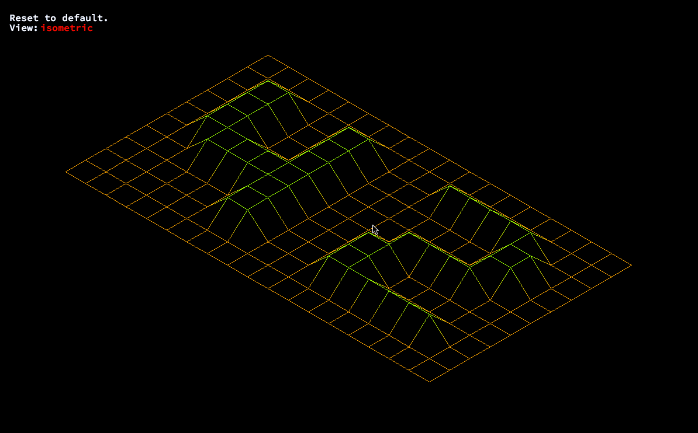

# 3D Wireframe Landscapes
Generate a 3D wireframe landscape from a simple input without the use of any standard libraries, written in C.
### result:
</br>

#### Install & Usage:
To download & setup the project simply clone the repository into the desired directory and run the Makefile.
```
git clone https://github.com/PvPrs/CWireframeLandscape.git
cd fdf
make
```
To run the project with one of the example maps execute the following command in the terminal.
```
./CWireframeLandscape maps/42.fdf
```
#### Input
The input is represented by 'values' ordered in position which simply represent the <b>height</b> of a specific coordinate.
```
  0  0  0  0  0  0  0  0  0  0  0  0  0  0  0  0  0  0  0
  0  0  0  0  0  0  0  0  0  0  0  0  0  0  0  0  0  0  0
  0  0 10 10  0  0 10 10  0  0  0 10 10 10 10 10  0  0  0
  0  0 10 10  0  0 10 10  0  0  0  0  0  0  0 10 10  0  0
  0  0 10 10  0  0 10 10  0  0  0  0  0  0  0 10 10  0  0
  0  0 10 10 10 10 10 10  0  0  0  0 10 10 10 10  0  0  0
  0  0  0 10 10 10 10 10  0  0  0 10 10  0  0  0  0  0  0
  0  0  0  0  0  0 10 10  0  0  0 10 10  0  0  0  0  0  0
  0  0  0  0  0  0 10 10  0  0  0 10 10 10 10 10 10  0  0
  0  0  0  0  0  0  0  0  0  0  0  0  0  0  0  0  0  0  0
  0  0  0  0  0  0  0  0  0  0  0  0  0  0  0  0  0  0  0
```
in this example the first coordinate to represent height is <b>2, 2</b> which has a height of <b>10</b>.

